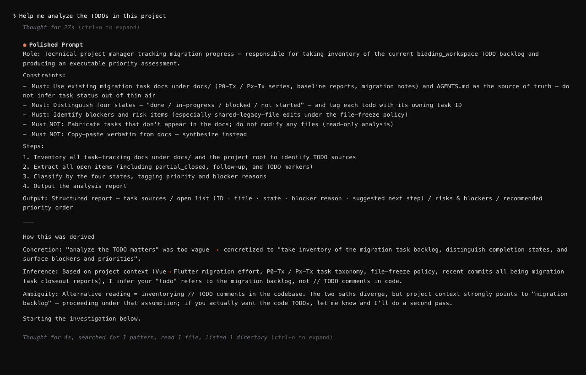

# Prompt Polisher

[](https://github.com/luckybilly/prompt-polisher/actions/workflows/ci.yml)

**Prompt Polisher** is a lightweight AI intent alignment tool that automatically polishes your prompts to expert level — solving the problem of AI misunderstanding your needs, acting without checking, and being too eager to please. No setup required — Prompt Polisher ensures every interaction confirms intent before execution, preventing wrong outputs and misunderstandings at the source.

English | [简体中文](./zh-CN/README.md)



## The Problem: Why AI Gets It Wrong

When working with AI, these issues come up constantly:

- **Silent assumptions** — Given a vague instruction, the AI fills in the blanks on its own and runs with it, no verification
- **No clarification** — When something is ambiguous, it picks one interpretation and ships it, instead of asking
- **Hidden reasoning** — The thinking process is opaque; you can't tell what the AI actually understood
- **Over-agreeable** — It goes along with whatever you type, never flagging bad requests or correcting sloppy wording
- **Mismatched weight** — Simple questions get bloated multi-step plans; complex problems get shallow one-liners

**There's no checkpoint between "user speaks" and "AI acts."**

Andrej Karpathy (former Director of AI at Tesla), after weeks of intensive LLM-assisted coding, [summarized the core frustration](https://x.com/karpathy/status/2015883857489522876):

> *"The most common category is that the models make wrong assumptions on your behalf and just run along with them without checking."*
>
> *"They also don't manage their confusion, they don't seek clarifications, they don't surface inconsistencies, they don't present tradeoffs, they don't push back when they should, and they are still a little too sycophantic."*

In short: **vague input ≠ license to interpret freely.** LLMs are missing a critical intent-alignment step.

## The Solution: Prompt Polisher Core Capabilities

Prompt Polisher inserts a mandatory alignment flow into every interaction. Before the AI touches any code, file, or action, it must complete these steps:

- **Standardized correction** — Automatically fixes typos, casual abbreviations, non-standard naming, and incomplete descriptions
- **Instruction concretization** — Transforms vague, broad requests into precise, actionable instructions
- **Deep intent inference** — Recovers what you actually need by combining conversation context and project state
- **Transparent reasoning** — Shows the full derivation before execution, so every correction and inference is traceable
- **Smart selective confirmation** — Pauses for your confirmation only when the request is ambiguous or could branch into meaningfully different outcomes; otherwise runs automatically with no slowdown

You see the polished prompt **before** execution starts — not after the damage is done.

### Before vs After

| Without Prompt Polisher | With Prompt Polisher |
|---|---|
| AI silently misinterprets vague inputs | Misinterpretations are caught and shown **before** execution |
| "fix npe in OrderSvc" → rewrites random code | → "Fix the NullPointerException in OrderService.calculateTotal()" |
| "optimize this API" → picks a random meaning | → Asks you which API and what "optimize" means when it genuinely can't tell |
| "write a poem" → writes a generic poem | → Infers style, theme, and form from context, shows reasoning |
| Simple question gets a 10-step plan | Output weight matches input complexity automatically |

## How It Works

```text
Understand → Align → Execute
```

No extra APIs, no standalone services — lightweight and embedded in every interaction:

1. **Parse & understand** — Break down the user input, identifying gaps, typos, ambiguity, and casual phrasing
2. **Polish & standardize** — Normalize terminology, fill in missing context, concretize the execution target
3. **Align intent** — Show the polished formal instruction + full derivation to the user
4. **Smart confirmation** — Pause and wait when ambiguity is high; execute immediately when it's not

### Example

**You type:** `fix npe in OrderSvc#calcTotal`

**Prompt Polisher shows:**

```markdown
## Polished Prompt

Fix the NullPointerException in OrderService.calculateTotal() — locate the
null-access point, add defensive null checks, and verify the fix.

### How this was derived
Corrections:
  - "npe" → "NullPointerException"
  - "OrderSvc" → "OrderService"
  - "#calcTotal" → "calculateTotal()"
Inferences:
  - NPE in a calculation method → likely an unchecked field access
    on a nullable object (e.g., item.getPrice() where item is null)
```

More examples → [EXAMPLES.md](EXAMPLES.md)

## Complementary to andrej-karpathy-skills

Two tools forming a complete AI collaboration pipeline:

- **Prompt Polisher (upstream)** — Sharpens **communication quality**, solves "what to do" — ensuring intent is accurate
- **[andrej-karpathy-skills](https://github.com/multica-ai/andrej-karpathy-skills) (downstream)** — Sharpens **execution quality**, solves "how to do it" — ensuring solid implementation

```text
User input (vague / natural language)
        │
        ▼
┌─────────────────────────────┐
│   Prompt Polisher           │  ← Communication quality:
│   Understand → Align        │     get "what to do" right
│   → Show Polished Prompt    │     User intervenes HERE
└─────────┬───────────────────┘
          │ Refined instruction
          ▼
┌─────────────────────────────┐
│   andrej-karpathy-skills    │  ← Execution quality:
│   Declarative / Test-first  │     get "how to do it" right
│   / Loop until criteria met │     User validates the result
└─────────────────────────────┘
```

**The key difference:** With andrej-karpathy-skills alone, the user's control point is at the **end** — you watch the result and judge if it's right. With Prompt Polisher, the control point moves to the **front** — you confirm the intent before any work begins.

## Install

### Option A: CLAUDE.md (per-project)

**New project** — no existing CLAUDE.md:

```bash
curl -o CLAUDE.md https://raw.githubusercontent.com/luckybilly/prompt-polisher/main/CLAUDE.md
```

**Existing project** — already has a CLAUDE.md:

```bash
echo "" >> CLAUDE.md && curl https://raw.githubusercontent.com/luckybilly/prompt-polisher/main/CLAUDE.md >> CLAUDE.md
```

### Option B: AI-Assisted Install

Paste this prompt into Claude Code in your project — the AI will handle the rest:

```text
Install Prompt Polisher for this project.

1. Check if CLAUDE.md exists in the project root
2. If not, fetch https://raw.githubusercontent.com/luckybilly/prompt-polisher/main/CLAUDE.md
   and save it as CLAUDE.md in the project root
3. If CLAUDE.md already exists, fetch the URL above and APPEND its full content
   to the end of the existing file (do NOT overwrite any existing content)
4. Confirm the installation is complete
```

### Option C: Manual Copy

1. Open [CLAUDE.md (raw)](https://raw.githubusercontent.com/luckybilly/prompt-polisher/refs/heads/main/CLAUDE.md), select all and copy
2. In your project root:
   - **New project** — create `CLAUDE.md` and paste
   - **Existing project** — open your `CLAUDE.md`, add a blank line at the end, then paste

## How to Know It's Working

After installing, try a test input:

> **Test input:** fix the null pointer bug in the code

**It's working if:** The AI doesn't jump straight to editing code — instead, it first shows a **polished instruction** + **derivation reasoning**.

In daily use, you'll notice:

- **Visible corrections** — You see what the AI fixed in your input (typos, abbreviations, naming)
- **Vague → concrete** — "fix the bug" becomes a specific, actionable instruction
- **Appropriate weight** — Simple questions get brief output, complex ones get thorough analysis
- **No silent execution** — You always see the polished prompt before the AI acts
- **Smart blocking** — The AI asks before acting only when the interpretation genuinely matters

## When Not to Use

- Trivial unambiguous inputs ("what day is it", simple calculations)
- Casual chat, no precision required

Prompt Polisher produces almost no extra output in these cases, but won't interfere either.

## FAQ

**No polishing after install?**
Check if CLAUDE.md is in the project root. Restart Claude Code / Cursor and try again.

**Does it slow me down?**
No. Only ambiguous, high-stakes inputs trigger a confirmation pause. Clear, simple inputs get polished and executed immediately — no extra interaction.

**Does it work with other AI tools?**
Natively supports Claude Code and Cursor. The CLAUDE.md rules are essentially LLM instructions — any tool that supports system prompts can theoretically use them.

## License

MIT
